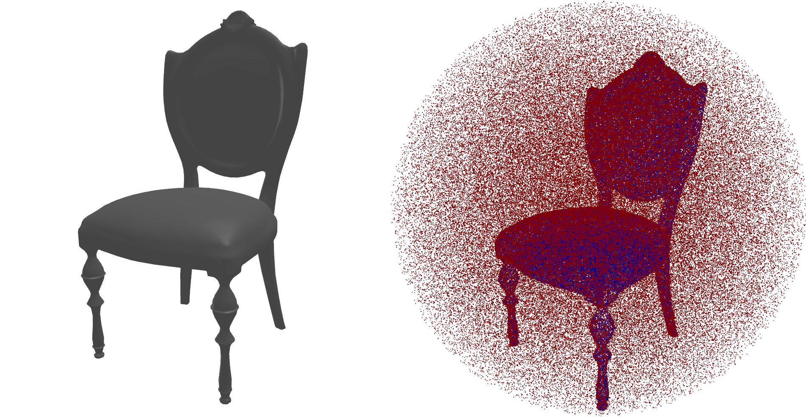

# Calculate signed distance fields for arbitrary meshes

This project calculates approximate SDFs for meshes.
It works for **non-watertight** meshes (meshes with holes), **self-intersecting** meshes, meshes with **non-manifold geometry** and meshes with **inconsistently oriented faces**.

## Examples

### Voxelize a mesh

The `mesh_to_voxels` function creates an N ✕ N ✕ N array of SDF values.
In this example, a mesh reconstructed using Marching Cubes and then rendered.

```python
from mesh_to_sdf import mesh_to_voxels

import trimesh
import skimage

VOXEL_RESOLUTION = 64

mesh = trimesh.load('chair.obj')

voxels = mesh_to_voxels(mesh, VOXEL_RESOLUTION, pad=True)

vertices, faces, normals, _ = skimage.measure.marching_cubes_lewiner(voxels, level=0, spacing=(2 / VOXEL_RESOLUTION, 2 / VOXEL_RESOLUTION, 2 / VOXEL_RESOLUTION))
mesh = trimesh.Trimesh(vertices=vertices, faces=faces, vertex_normals=normals)
mesh.show()
```


### Sample SDF points non-uniformly near the surface

This example creates 250,000 points, where most of the points are close to the surface and some are sampled uniformly.
This is the method that is proposed and used in the [DeepSDF paper](https://arxiv.org/abs/1901.05103).
In this example, the resulting points are rendered in red where the SDF is positive and in blue where it is negative.

```python
from mesh_to_sdf import sample_sdf_near_surface

import trimesh
import pyrender
import numpy as np

mesh = trimesh.load('chair.obj')

points, sdf = sample_sdf_near_surface(mesh, number_of_points=250000)

colors = np.zeros(points.shape)
colors[sdf < 0, 2] = 1
colors[sdf > 0, 0] = 1
cloud = pyrender.Mesh.from_points(points, colors=colors)
scene = pyrender.Scene()
scene.add(cloud)
viewer = pyrender.Viewer(scene, use_raymond_lighting=True, point_size=2)
```



## How it works

The general pipeline for calculating SDF in this project is as follows:

1. Create 100 virtual laser scans of the shape from multiple angles.
These each consist of a normal buffer and a depth buffer.
2. Use the inverse MVP matrix and depth buffer of each scan to calculate a world-space surface point cloud
3. Determine the value of the SDF for each query point by finding the closest surface point using a kd-tree
4. Determine the sign of the SDF using either the normal of the closest surface point or by checking it against the depth buffers of the scans.
When using normals, the sign is determined with a dot product.
When using the depth buffer method, the point is projected in the frame of each render.
By comparing the depth element of the depth buffer and depth of the query point, we determine if the query point is seen by the camera.
The sign of the point is positive if it is seen by any of the cameras.

This repository contains an implementation of the procedure proposed in the [DeepSDF paper](), as well as some alternatives.